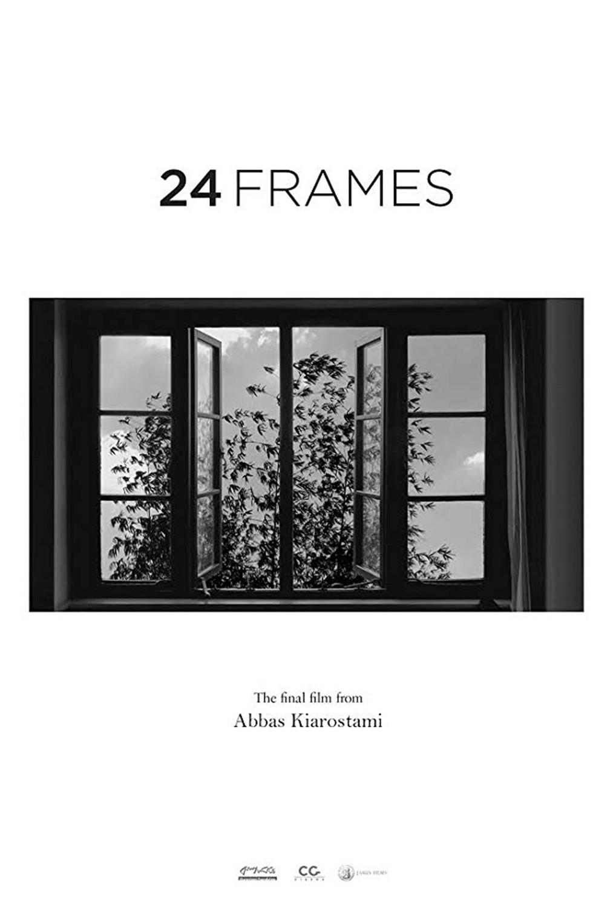
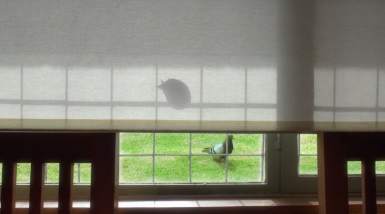

# 24Frames

:point_up_2:

## 1frame

## 2frame

## 3frame

## 4frame

## 5frame

## 6frame

## 7frame

## 8frame

## 9frame

## 10frame

## 11frame

## 12fame

## 13frame

## 14frame

## 15frame

## 16frame

## 17frame

## 18frame

## 19frame

## 20frame

## 21frame

## 22frame

## 23frame

## 24frame

