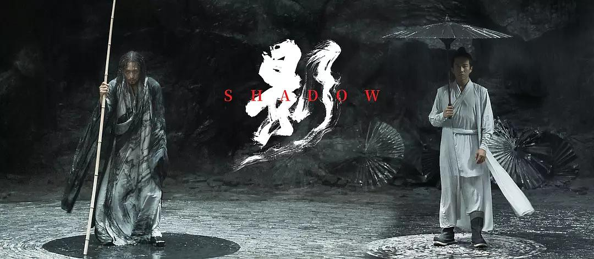

# 走不出『长城』的阴影

『影』为人称道的水墨、太极等中国元素，在我看来和长城的五色军团没有什么本质区别，一样刻意的形式化，一而再，再而三地太极卦象图特写，一合、二合、三合，每次一回合打完，子虞和境州都要回归阴鱼阳眼、阳鱼阴眼，你说这叫大师的格调，不好意思，我真不懂。

充斥着整部电影的水墨华服、书法屏风，不但没有增色，反而像是个技穷的老手艺人，一直重复着同一段曲调。老调弹又弹，谈又谈，可能是我这个年纪最难接受烦人的唠叨吧，单单这点就让我的观影过程变得煎熬。国画，水墨的表达是好，但是再丰厚美好的东西，再三强调，总会让人不胜其烦。再加上水墨意境又是素雅的东西，如此堆砌，『影』变得更像是一部话剧，电影感全无。

堆砌的水墨笔调一般是不会出现在大师手里的，国画讲究的是气，留白，密不透风的那不是画，就是一滩毫无意义的墨渍。现代国画有很多重复堆砌的大尺幅的例子，说好听点是工匠精神，是格调，其实呢是什么，就是内心空洞的表现，像极了在舞台上新手舞者那无处安放的手脚，只是机械地重复摆着一些脑海里仅存的舞蹈动作，你问他为什么这么跳，他红着脖子和你吼，你懂什么。

这时候我开始想，这是不是就是大师的真实水平了，是我们这届观众太差劲了，才要大师如此放下身段，像教小朋友一样告诉我们什么是中国文化。

文化背景上的缺陷可能对绝大多数人来说不是什么大影响，毕竟这是部剧情片啊，剧情能撑起一片天就行了，但是事实呢，只能打动编剧自己的剧情，莫名其妙的悬念，故作高深的表述，缺失的感染力，很难触及心里那块痒痒肉，我只能将其归为只能算作及格线以上的话剧类电影。

话剧感的产生，还有个原因，就是邓超的表演，一人分饰两角，子虞和境州，一个是沛国的头脑，本是天却堕入黑暗，一个来自境州，从战乱中走来却成就了沛国收复境州的荣光；一瘦削，一健壮。抛却明显的话剧感式对立不谈，邓超的表演是很卖力的，让人能感受到他们这代演员的敬业专注，但是就因为境州太像境州，子虞太像子虞，以及田战尴尬的一句“有时候我也迷离了，你究竟是境州还是都督”，让人很难产生共鸣。总觉得我换个马甲，你田战就能不认识我了。

最后你问『影』想表达的是什么，我可能要愣神一会儿，张导迷幻水墨国术让我暂时失去了思考的能力。其实这是个很俗套的故事，替身反客为主，代替了真身，一切都按照张导安排的节奏走，推搡着思绪向前，为了行动而行动，不论是影子还是真身。为了风格而风格，水平所限吧，6.1算给面子吧。

