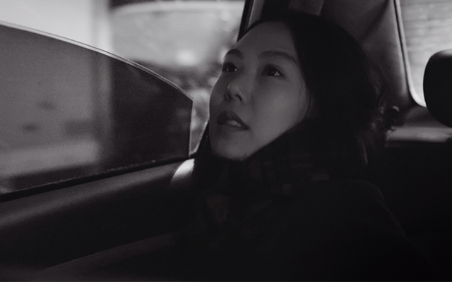

# 遇见我的 100% 女孩

> 你对我说了一句“你好”

> 夜晚就过去了一半

心动的感觉啊，就是当我鼓足勇气准备好说“你好”的时候，我们已经快到终点站了。

昨夜下了场小雨，白露的清晨就显得格外清爽。我在尝试了两天单车上下班后，就爱上了这种感觉，趁着好天气多享受这份自在，心里走马灯似的慵懒播放着那些闪光的瞬间。

店员熟练地输入没有条形码的散装酸奶的序列号，卡顿的 NFC 读卡器，空气中隐隐约约的黑人小伙伴身上的香水味，转角倒映着白色的天空的一滩积水，没有红绿灯的路口停下来避让等待中行人的车队

门口的路障颠出了一个念头，要是能再碰到那个女生的话，我就跟她一起上公交。

是的，有时候就是这么神奇，我向街对面望去，看到了那个洪尚秀梦中情人的身影。

这边后面的车队快要走完了

好的，停下来让我先过马路了

那边的车队直接让我了耶，不过不好意思，我不过这侧马路

往前走走公交车站那边，单车就先停在共享车堆里吧

她还在后面走嘛，希望待会儿的 193 人不要太多

欸~莫不是碰到了传说中的 193 plus

让她先上车，这样我好坐在她旁边

她坐在了过道这边耶，看来是不希望旁边有人坐

车厢另一侧小哥坐在了靠窗这边，那很棒了我就坐在小哥旁边了

静静看着也是一种很享受了

要不要搭话，怎么开口，在线等挺急的...

上一次手足无措，内心天人交战紧张准备讲话措辞还是初中的时候，报送的我给同学中考前作考前动员。网上令人尴尬的搭讪套路我是打心底鄙视的，我要是被这种套路搭讪也会觉得莫名其妙，再者也没有了后续的话题，太套路做作了...

真的，当我鼓足勇气准备好说“你好”的时候，我们已经快到终点站了。

还是谈谈电影吧，谈谈她给我的感受吧

> 雅凜，是你啊

人们都说，最对的时间遇上对的人是极其幸运的。我觉得对一半吧，因为这句话包含了两件事『希望』和『等待』，『希望』是美好的，但是『等待』却是让我最为揪心的。

人们也总是习惯性地用『漫长』来修饰『等待』，好像在到达『希望』的路上，总是漫漫慢慢，我也没法保证在这『等待』的过程中，在希望出现之前，不将就，没有随便就找个人过活日子。

可能真的有那么个人，和我一样十八般武艺样样『略懂略懂』，和我一样时而幼稚，时而深沉，而我也和她一样对生活有着自己的品质追求，和她一样像阳光温暖身边的人。

世上最悲哀的事情，就是你在超市买东西的时候碰到了那个命里对的人，她看到了你又把手插在了米里，对你说『这样不好』，你窘迫地搓搓手，说了句『抱歉』，逃也似的走了。所以啊，最悲哀的事情啊，就是最『对』的两个人连认识的机会也没有。

所幸，我还是和你说了句『你好』，不不不，不对，我还真的只是说了句『你好』，我连姑娘你的名字都还不知道呢，联系方式也没留。知道再多的和异性聊天的技巧，在碰到喜欢的人的时候，还是一场兵荒马乱、丢盔弃甲。

> 看到你的时候，我真想挖个坑把我们埋了

我觉得我的想象力和星辰大海也就差了那么一星半点吧，就在刚刚敲字的过程中，脑海中闪现了无数个将来有姑娘你的闪光时刻，连我们埋哪都想好了 :joy: 

工位旁的 Keillion 说我笑得像个傻子，脸上绷不住的笑容，问我是不是又在写小黄文。

我说，不好意思，你用右手，我用左手，你不会懂我的。

Keillion 说，肯定恋爱了，傻子

我是那么容易被猜到的嘛，恋爱都谈不上吧，毕竟，我连姑娘姓甚名谁都不知道。只是记得头发高高束起的样子很好看，散发着我假想的香气，淡眉，嘴唇润润的，右边鬓角没有扑开的粉底，上身是白色雪纺的嘛，裤子是牛仔的吧，应该也有可爱的脚踝吧。

越是要仔细回想，就越难琢磨，算了吧，下次再碰到我的时候，记得给我留联系方式哦，我记性不好，看到美好的事物的时候，主观能动性总是会被意识流冲得很远很远，只记得是一个非常舒服的九月的清晨，我认识了那个姑娘。

